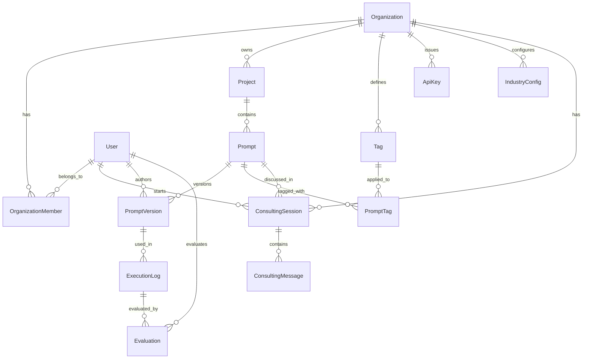

# Domain Model

## Aggregate Map

```
Organization (Tenant Boundary)
├── User
├── ApiKey
├── Project
│   ├── Prompt
│   │   ├── PromptVersion (immutable)
│   │   └── PromptTag
│   └── ExecutionLog
│       └── Evaluation
├── Tag
├── IndustryConfig
└── ConsultingSession
    └── ConsultingMessage
```

---

## Layer 1: Prompt Management Platform

### Organization (組織)

テナントの境界。個人利用の場合は 1 人の Organization。

| Field | Type | Constraints | Description |
|-------|------|-------------|-------------|
| ID | OrganizationID (UUID) | PK | 一意識別子 |
| Name | OrganizationName | 2-100 chars, not blank | 表示名 |
| Slug | OrganizationSlug | 2-50 chars, `[a-z0-9-]`, unique | URL 用識別子 |
| Plan | Plan (enum) | free / pro / team / enterprise | 課金プラン |
| CreatedAt | timestamp | auto | 作成日時 |
| UpdatedAt | timestamp | auto | 更新日時 |

### User (ユーザー)

| Field | Type | Constraints | Description |
|-------|------|-------------|-------------|
| ID | UserID (UUID) | PK | 一意識別子 |
| Email | UserEmail | valid email, unique | メールアドレス |
| Name | UserName | 2-100 chars, not blank | 表示名 |
| CreatedAt | timestamp | auto | 作成日時 |
| UpdatedAt | timestamp | auto | 更新日時 |

### OrganizationMember (組織メンバーシップ)

User と Organization の多対多。

| Field | Type | Constraints | Description |
|-------|------|-------------|-------------|
| OrganizationID | OrganizationID | FK, PK | 組織 |
| UserID | UserID | FK, PK | ユーザー |
| Role | MemberRole (enum) | owner / admin / member / viewer | ロール |
| JoinedAt | timestamp | auto | 参加日時 |

### ApiKey (API キー)

SDK / 外部システム連携用。

| Field | Type | Constraints | Description |
|-------|------|-------------|-------------|
| ID | ApiKeyID (UUID) | PK | 一意識別子 |
| OrganizationID | OrganizationID | FK | 所属組織 |
| Name | ApiKeyName | 2-100 chars | キー名 |
| KeyHash | string | SHA-256 | ハッシュ化キー |
| KeyPrefix | string | `pl_(live|test)_` | プレフィクス (表示用) |
| LastUsedAt | timestamp | nullable | 最終使用日時 |
| ExpiresAt | timestamp | nullable | 有効期限 |
| RevokedAt | timestamp | nullable | 無効化日時 |
| CreatedAt | timestamp | auto | 作成日時 |

### Project (プロジェクト)

プロンプトのグループ。アプリケーションや用途ごとに作成。

| Field | Type | Constraints | Description |
|-------|------|-------------|-------------|
| ID | ProjectID (UUID) | PK | 一意識別子 |
| OrganizationID | OrganizationID | FK | 所属組織 |
| Name | ProjectName | 2-100 chars, not blank | プロジェクト名 |
| Slug | ProjectSlug | 2-50 chars, `[a-z0-9-]` | URL 用識別子 |
| Description | ProjectDescription | max 500 chars, optional | 説明 |
| CreatedAt | timestamp | auto | 作成日時 |
| UpdatedAt | timestamp | auto | 更新日時 |

**Unique**: (OrganizationID, Slug)

### Prompt (プロンプト)

バージョン管理の対象。

| Field | Type | Constraints | Description |
|-------|------|-------------|-------------|
| ID | PromptID (UUID) | PK | 一意識別子 |
| ProjectID | ProjectID | FK | 所属プロジェクト |
| Name | PromptName | 2-200 chars, not blank | プロンプト名 |
| Slug | PromptSlug | 2-80 chars, `[a-z0-9-]` | URL 用識別子 |
| PromptType | PromptType (enum) | system / user / combined | 種別 |
| Description | PromptDescription | max 1000 chars, optional | 説明 |
| LatestVersion | VersionNumber (int) | >= 0, default 0 | 最新バージョン番号 |
| ProductionVersion | VersionNumber (int) | nullable | 本番バージョン番号 |
| CreatedAt | timestamp | auto | 作成日時 |
| UpdatedAt | timestamp | auto | 更新日時 |

**Unique**: (ProjectID, Slug)

**PromptType**:
- `system`: LLM の挙動を制御するシステムプロンプト
- `user`: ユーザー入力のテンプレート
- `combined`: system + user の組み合わせ

### PromptVersion (プロンプトバージョン)

**イミュータブル（作成後は変更不可）**。ステータスのみ遷移する。

| Field | Type | Constraints | Description |
|-------|------|-------------|-------------|
| ID | PromptVersionID (UUID) | PK | 一意識別子 |
| PromptID | PromptID | FK | 親プロンプト |
| VersionNumber | VersionNumber (int) | >= 1, auto-increment | バージョン番号 |
| Status | VersionStatus (enum) | draft / review / production / archived | ステータス |
| Content | PromptContent (JSON) | not null | プロンプト内容 |
| Variables | PromptVariables (JSON) | nullable | テンプレート変数定義 |
| ChangeDescription | ChangeDescription | max 500 chars, optional | 変更説明 |
| SemanticDiff | SemanticDiff (JSON) | nullable, cached | 前バージョンとの意味的差分 |
| LintResult | LintResult (JSON) | nullable, cached | Lint 結果キャッシュ |
| AuthorID | UserID | FK | 作成者 |
| PublishedAt | timestamp | nullable | Production 昇格日時 |
| CreatedAt | timestamp | auto | 作成日時 |

**Unique**: (PromptID, VersionNumber)

**VersionStatus 遷移ルール**:
```
draft → review → production → archived
draft → archived (破棄)
production → archived (別バージョンが production に昇格時)
```

**PromptContent JSON**:
```json
{
  "system_prompt": "You are a helpful assistant that...",
  "user_template": "Given the following context: {{context}}\n\nQuestion: {{question}}",
  "metadata": {
    "model_recommendation": "claude-sonnet-4-6",
    "temperature": 0.7,
    "max_tokens": 1024
  }
}
```

**PromptVariables JSON**:
```json
[
  {
    "name": "context",
    "type": "string",
    "required": true,
    "description": "Background context for the question",
    "default_value": null
  }
]
```

**SemanticDiff JSON** (LLM 生成、キャッシュ):
```json
{
  "summary": "汎用アシスタントからコーディング特化に変更",
  "changes": [
    {"category": "scope", "description": "回答スコープをコーディングに限定"},
    {"category": "variable", "description": "新変数 {{language}} を追加"}
  ],
  "impact_prediction": {
    "specialization": "increase",
    "generality": "decrease",
    "estimated_token_change": "+15"
  },
  "previous_version": 3
}
```

**LintResult JSON**:
```json
{
  "score": 85,
  "rules": [
    {"rule": "define-output-format", "severity": "info", "message": "出力フォーマットの指定がありません"},
    {"rule": "variable-unused", "severity": "error", "message": "変数 'context' が未使用です"}
  ],
  "passed": true
}
```

### ExecutionLog (実行ログ)

LLM へのリクエスト/レスポンスの記録。イミュータブル。

| Field | Type | Constraints | Description |
|-------|------|-------------|-------------|
| ID | ExecutionLogID (UUID) | PK | 一意識別子 |
| PromptVersionID | PromptVersionID | FK | 使用バージョン |
| OrganizationID | OrganizationID | FK | 所属組織 (非正規化) |
| RequestBody | RequestBody (JSON) | not null | リクエスト内容 |
| ResponseBody | ResponseBody (JSON) | not null | レスポンス内容 |
| ProviderName | ProviderName | max 50 chars | LLM プロバイダー名 |
| ModelName | ModelName | max 100 chars | 使用モデル名 |
| TokenUsage | TokenUsage (JSON) | nullable | トークン使用量 |
| LatencyMs | LatencyMs (int) | >= 0, nullable | レスポンス時間(ms) |
| Metadata | Metadata (JSON) | nullable | 任意のメタデータ |
| ExecutedAt | timestamp | not null | 実行日時 |
| CreatedAt | timestamp | auto | 記録日時 |

### Evaluation (評価)

| Field | Type | Constraints | Description |
|-------|------|-------------|-------------|
| ID | EvaluationID (UUID) | PK | 一意識別子 |
| ExecutionLogID | ExecutionLogID | FK | 対象ログ |
| EvaluatorID | UserID | FK, nullable | 評価者 (null = 自動) |
| EvaluationType | EvaluationType (enum) | manual / automated | 評価種別 |
| OverallScore | Score (decimal) | 0.0 - 100.0 | 総合スコア |
| CriteriaScores | CriteriaScores (JSON) | nullable | 基準別スコア |
| Comment | EvaluationComment | max 2000 chars, optional | コメント |
| CreatedAt | timestamp | auto | 作成日時 |

### Tag / PromptTag

(前回と同一のため省略)

---

## Layer 2: Industry Consulting Chat

### IndustryConfig (業界設定)

組織がどの業界向けコンサルを利用するかの設定。

| Field | Type | Constraints | Description |
|-------|------|-------------|-------------|
| ID | IndustryConfigID (UUID) | PK | 一意識別子 |
| OrganizationID | OrganizationID | FK, unique per industry | 組織 |
| Industry | Industry (enum) | see below | 業界種別 |
| Enabled | bool | default true | 有効/無効 |
| CustomKnowledge | CustomKnowledge (JSON) | nullable | カスタムナレッジ |
| CreatedAt | timestamp | auto | 作成日時 |
| UpdatedAt | timestamp | auto | 更新日時 |

**Unique**: (OrganizationID, Industry)

**Industry enum**:
- `healthcare` — ヘルスケア
- `legal` — 法律
- `finance` — 金融
- `customer_support` — カスタマーサポート
- `education` — 教育
- `ecommerce` — EC/小売
- `general` — 汎用

**CustomKnowledge JSON**:
```json
{
  "guidelines": [
    "当社では必ず丁寧語を使用する",
    "製品名は正式名称を使用する"
  ],
  "terminology": {
    "CS": "カスタマーサポート",
    "FAQ": "よくある質問"
  },
  "compliance_rules": [
    "個人情報を含む回答は禁止",
    "医療アドバイスは免責事項を付ける"
  ]
}
```

### ConsultingSession (コンサルセッション)

チャットの会話セッション。

| Field | Type | Constraints | Description |
|-------|------|-------------|-------------|
| ID | SessionID (UUID) | PK | 一意識別子 |
| OrganizationID | OrganizationID | FK | 組織 |
| UserID | UserID | FK | 開始ユーザー |
| Title | SessionTitle | max 200 chars, auto-generated | セッションタイトル |
| Industry | Industry (enum) | nullable | 業界コンテキスト |
| PromptID | PromptID | FK, nullable | 対象プロンプト (特定プロンプトの相談時) |
| Status | SessionStatus (enum) | active / closed | ステータス |
| CreatedAt | timestamp | auto | 作成日時 |
| UpdatedAt | timestamp | auto | 更新日時 |

### ConsultingMessage (コンサルメッセージ)

セッション内の個別メッセージ。

| Field | Type | Constraints | Description |
|-------|------|-------------|-------------|
| ID | MessageID (UUID) | PK | 一意識別子 |
| SessionID | SessionID | FK | 所属セッション |
| Role | MessageRole (enum) | user / assistant | 発言者 |
| Content | MessageContent (text) | not blank | メッセージ内容 |
| Citations | Citations (JSON) | nullable | 参照したデータソース |
| ActionsTaken | ActionsTaken (JSON) | nullable | 実行されたアクション |
| CreatedAt | timestamp | auto | 作成日時 |

**Citations JSON** (コンサルが参照したデータの出典):
```json
[
  {
    "type": "prompt_version",
    "prompt_id": "uuid",
    "version_number": 5,
    "excerpt": "You are a helpful..."
  },
  {
    "type": "execution_log",
    "log_id": "uuid",
    "score": 72.3
  },
  {
    "type": "industry_knowledge",
    "industry": "healthcare",
    "topic": "HIPAA compliance requirements"
  },
  {
    "type": "platform_benchmark",
    "metric": "avg_score",
    "industry": "healthcare",
    "value": 85.1
  }
]
```

**ActionsTaken JSON** (チャットから直接実行されたアクション):
```json
[
  {
    "type": "create_version",
    "prompt_id": "uuid",
    "version_number": 6,
    "description": "コンサル提案に基づく改善"
  },
  {
    "type": "lint_check",
    "prompt_id": "uuid",
    "version_number": 5,
    "result_score": 85
  }
]
```

### PlatformBenchmark (プラットフォームベンチマーク)

匿名化されたクロス組織統計。定期バッチで集計。

| Field | Type | Constraints | Description |
|-------|------|-------------|-------------|
| ID | BenchmarkID (UUID) | PK | 一意識別子 |
| Industry | Industry (enum) | not null | 業界 |
| Metric | BenchmarkMetric (enum) | see below | 指標種別 |
| Period | BenchmarkPeriod | YYYY-MM format | 集計期間 |
| P25 | decimal | | 25 パーセンタイル |
| P50 | decimal | | 50 パーセンタイル (中央値) |
| P75 | decimal | | 75 パーセンタイル |
| P90 | decimal | | 90 パーセンタイル |
| SampleSize | int | >= 0 | サンプル数 |
| CalculatedAt | timestamp | auto | 集計日時 |

**Unique**: (Industry, Metric, Period)

**BenchmarkMetric enum**:
- `avg_score` — 平均品質スコア
- `avg_latency_ms` — 平均レイテンシ
- `avg_tokens` — 平均トークン数
- `avg_cost_per_1k` — 1000 リクエストあたりコスト

---

## Domain Rules

### バージョン管理ルール

1. PromptVersion の Content は作成後**変更不可**
2. Status のみ遷移可能: draft → review → production → archived
3. 1 つの Prompt に対して production は**最大 1 つ**
4. production に昇格時、前の production は自動的に archived に
5. VersionNumber は Prompt 内で自動インクリメント

### 実行ログルール

1. ExecutionLog は必ず PromptVersion に紐付ける
2. ExecutionLog は作成後**変更不可**
3. OrganizationID は非正規化（クエリ効率のため）

### 評価ルール

1. 1 ExecutionLog に複数 Evaluation 可能
2. 手動評価は EvaluatorID 必須、自動評価は null
3. OverallScore は 0.0 - 100.0

### コンサルチャットルール

1. コンサルは自組織のデータのみ参照可能
2. PlatformBenchmark はオプトイン組織のデータのみ集計
3. Citations で参照元を必ず明示（ハルシネーション防止）
4. ActionsTaken でチャットから作成されたバージョンを追跡

### マルチテナンシー

1. すべてのクエリは OrganizationID でフィルタ
2. Organization 境界を越えたデータアクセス不可
3. User は複数 Organization に所属可能

---

## Aggregate Boundaries

| Aggregate Root | 含むエンティティ | 整合性境界 |
|---------------|-----------------|-----------|
| Organization | Member, ApiKey, Tag, IndustryConfig | 組織設定 |
| Project | - | メタデータ |
| Prompt | PromptVersion, PromptTag | バージョン整合性 |
| ExecutionLog | Evaluation | ログと評価 |
| ConsultingSession | ConsultingMessage | チャット履歴 |
| PlatformBenchmark | - | 集計データ |

---

## ER Diagram


